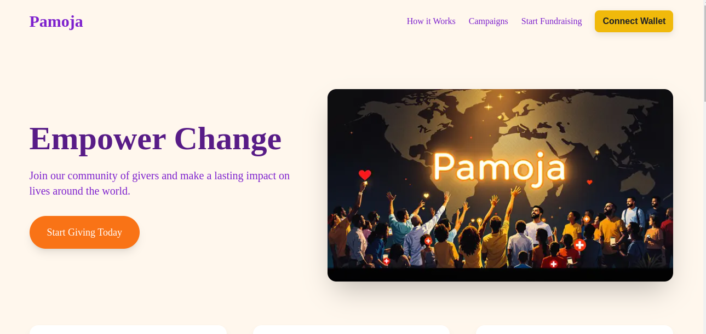

# Pamoja Crowdfunding DApp

Pamoja is a decentralized crowdfunding application built on Solidity and deployed using Hardhat. The frontend is developed using Next.js.



## Folder Structure

- **/packages/contracts**: Contains the Solidity smart contracts for the Pamoja DApp.
- **/packages/scripts/**: Contains scripts to deploy and interact with the smart contracts.
- **/packages/test/**: Contains test scripts to test the smart contracts using Hardhat.
- **/packages/frontend/**: Contains the Next.js frontend application.

## Getting Started

### Technical Stack

- **Frontend**: Next.js
- **UI Components**: Lucide React
- **Blockchain Development**: Hardhat + Remix
- **Blockchain Deployment**: Ethereum Sepolia
- **Smart Contract**: Solidity
- **Web3 Integration**: Ether.js

### Main Contract Features

- Create and manage fundraising campaigns
- Accept donations in ETH
- Multi-admin support for campaign management
- Secure donation handling and fund management
- Automated campaign completion on target achievement and date expiry
- Campaign lifecycle management (active, completed, deleted)
- Complete transparency with on-chain tracking of donations and withdrawals
- Campaign cancellation protection when funds are raised

## Development Setup

### Setup

1. Clone this repository:

   ```bash
   git clone <repository-url>
   cd <repository-folder>
   cd packages/frontend
   ```

2. Install dependencies:

   ```bash
   npm install
   ```

3. Run the development server:

   ```bash
   npm run dev
   ```

4. Configure blockchain ABI using your contracts ABI and contract address.

## Contributing

We welcome contributions! Please follow these steps:

1. Fork the repository
2. Create a feature branch
3. Commit changes
4. Submit a pull request

## License

MIT License

## Appendices

- **Smartcontract Repo**: [Link](https://github.com/Kennjenga/crowdfunding/)
- **Undugu Live**: [Link](https://pamoja-iota.vercel.app/)
